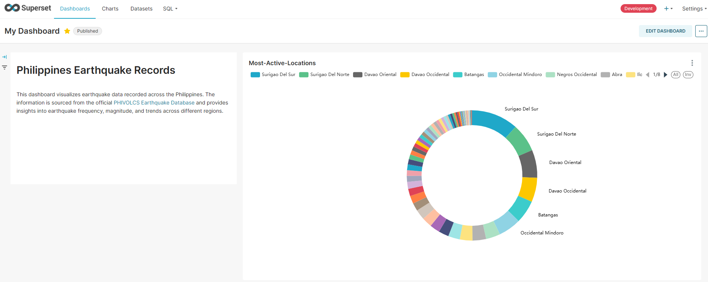
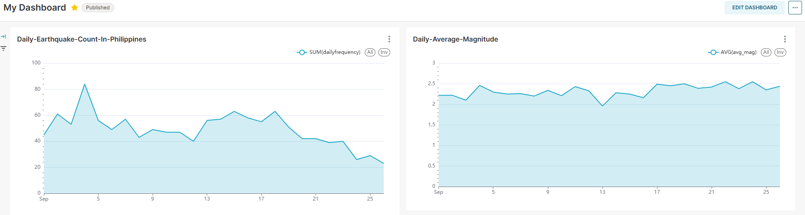
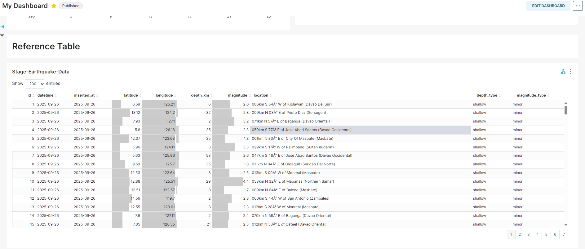

# Philippines Earthquake Records ETL Pipeline
Automated data pipeline that extracts, transforms, and loads earthquake data from the Philippines into a PostgreSQL database using Airflow and dbt, with final dashboards displayed in Superset.

## Video Link
- **Youtube**: [Watch on YT](https://youtu.be/VQQe5uidCOk)
  
## Project Overview
The project automates the collection and processing of earthquake data from [PHIVOLCS](https://earthquake.phivolcs.dost.gov.ph/). It fetches raw earthquake data using **SOAP** for HTML parsing, removed duplicates and null using pandas, processes it with Python scripts, 
runs transformations with dbt, and loads it into PostgreSQL for analytics. The entire workflow is scheduled and managed using Apache Airflow, containerized with Docker, and visualized using Superset.

### Dashboard Preview
Here is an example Superset dashboard showing the processed weather metrics:



---

## Key Features
- Scheduled ETL pipeline using Airflow (PythonOperator & DockerOperator)
- Data transformation and modeling with dbt
- Automated aggregation of earthquake metrics:
  - Most active locations
  - Daily earthquakes count
  - Daily average magnitude
- Containerized using Docker and Docker Compose
- Visualized with Apache Superset

### My Dashboard Charts





---

## Technologies & Skills
- Python, SQL (PostgreSQL), HTML Parsing(Soap)
- Apache Airflow (DAGs, Operators, scheduling)
- Docker & Docker Compose
- dbt (data modeling & transformations)
- Apache Superset (visualization)

---

## How to Use the Project

### Prerequisites
Before running the project, make sure you have:

1. **Docker Desktop**  
   - Download and install for your platform: [https://docs.docker.com/desktop/](https://docs.docker.com/desktop/)  
   - Make sure Docker is **running** before continuing.

2. **Git**  
   - Required to clone the repository: [https://git-scm.com/downloads](https://git-scm.com/downloads)

---

### Step 1: Clone the Repository
- Go to Desktop
- Right Click then select (Open Git Bash here)
- Run the commands:

```bash
git clone https://github.com/Dan013577947/latest_earthquake_records.git
cd latest_earthquake_records

```
### Step 2: Start the Project with Docker
- Inside the project folder, run:

```bash
dos2unix docker/docker-init.sh
dos2unix docker/docker-bootstrap.sh
docker-compose up --build
```
- Wait for it to finish the setup

### Step 3: Access the Superset
- **user:** admin
- **password:** admin <br>

Open you browser and go to:

```bash
http://127.0.0.1:8088
```

## Step 4: Stop the Project

When finished, shut down all containers:

```bash
docker compose down
```
